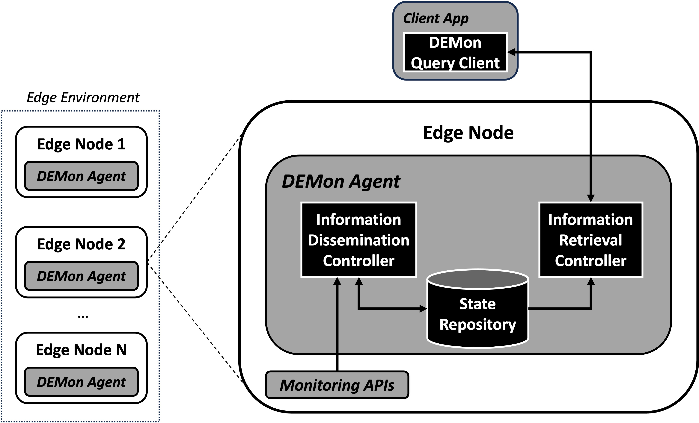

# A Decentralized and Self-Adaptive Approach for Monitoring Volatile Edge Environments

## Abstract
Edge computing offers resources for latency-sensitive Internet of Things (IoT) workloads through highly distributed computing
infrastructure at the network edge. Monitoring systems are essential for efficiently managing resources and application workloads by
collecting, storing, and providing relevant information about the state of the resources. However, traditional monitoring systems have a
centralized architecture for both data plane and control plane, which collects and stores the data in centralized remote servers. Such an
architecture increases the communication latency for information storage and retrieval. Also, it creates a failure bottleneck, especially
in Edge, where infrastructures are often built upon failure-prone, unsophisticated computing and network resources. Moreover, the
Edge resources are arbitrarily (de)provisioned, which creates further challenges for providing quick and trustworthy data. Thus, it is
crucial to design and build a monitoring system that is decentralized, fast, and trustworthy for such volatile Edge computing systems.
Therefore, we propose the Decentralised Edge Monitoring (DEMon) framework, a decentralized, self-adaptive monitoring system for
highly volatile Edge environments. DEMon leverages the stochastic Gossip communication protocol at its core. It develops techniques
and a framework for efficient control of information dissemination, communication, and retrieval, avoiding a single point of failure
and ensuring fast and trustworthy data access. Its decentralized control enables self-adaptive management of monitoring parameters,
addressing the tradeoffs between the Quality of Service of monitoring and resource consumption. We implement the proposed system
as a lightweight and portable container-based monitoring system and evaluate it through empirical experiments. We also present an
experimental use case demonstrating the feasibility of the proposed system. The results show that DEMon efficiently disseminates and
retrieves the monitoring information, addressing the above-mentioned challenges.

## Contributions
- We present [`DEMon`](./src), a reliable and self-adjusting monitoring system designed for extremely dynamic edge environments, offering both efficient and decentralized information dissemination.
- Introducing a stochastic group communication protocol featuring a gossip-based information dissemination algorithm and the [`impact of its hyperparameter`](./experiments/emulation-exp). Additionally, we propose the Leaderless Quorum Consensus (LQC) protocol for efficient and trustworthy data retrieval.
- We also provide a practical real-world use case implementation, demonstrating a [`mobile computing edge scenario on a Raspberry Pi`](./experiments/use-case-exp).